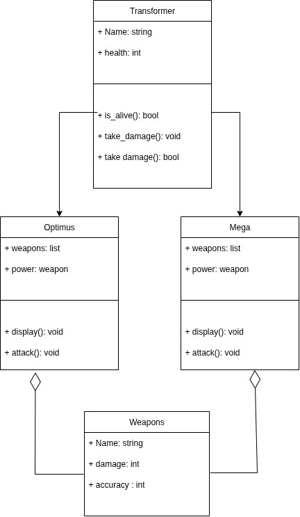
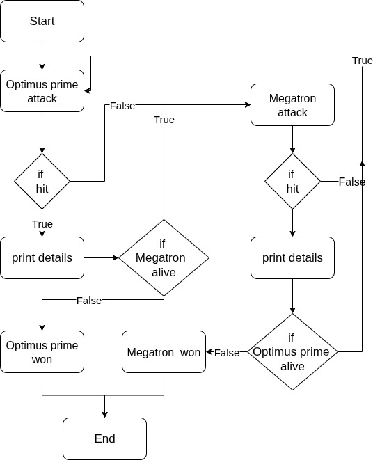

# MIA-Task8
- **A fight simulation** between Optimus prime and Megatron
- Each transformer has 3 weapons where the simulation choose one of them **randomly** and attack with it
- the simulation runs until one of their **health drops to zero**

## 1- UML & state machine diagram
**project UML:**

**project tate machine diagram:**

## 2- Classes
**weapon:**
- Attributes: name, damage, accuracy
- created only to store all data for weapons

**Transformer** (Abstract class)
- Attributes: name, health
- Methods: is_alive(), take_damage(), possibility()

**optimus / mega**
- Attributes: 
    - list weapons containing each transformer weapons
    - power which is assigned to the weapon chosen

- Methods:
    - display(): display a feedback message after each attack
    - attack(): choose a random weapon and simulate the attack

